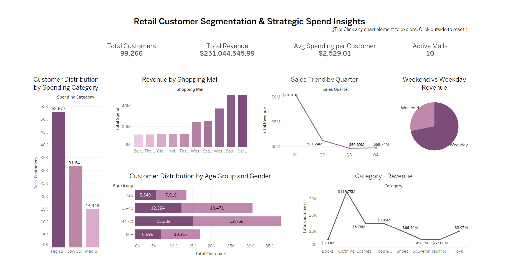

# 🧠 Retail Customer Segmentation Dashboard – Dual Tool Implementation

## Overview
This project demonstrates tool-agnostic dashboarding skills by building the **same business analysis** in both **Power BI** and **Tableau**. It showcases my adaptability, visual design principles, and insight delivery — regardless of platform.

## Objective
To analyze and visualize customer segmentation and spending trends across shopping malls, categories, and demographics using:
- 📌 Clean KPI presentation
- 📈 Time trend analysis
- 📍 Regional performance
- 👥 Demographic breakdowns

## Tools Used
- Power BI (original dashboard)
- Tableau (recreated dashboard using same dataset)
- Microsoft Excel (data source)

## Why This Project Matters
This project proves my ability to:
- Switch between tools quickly and effectively
- Deliver consistent business insights under different UI/UX constraints
- Design interactive, stakeholder-facing dashboards with cross-filtering, clean layouts, and storytelling impact

## Tableau Public Dashboard

👉 [https://public.tableau.com/views/customersegmentation_17495194202810/Dashboard3?:language=en-US&publish=yes&:sid=&:redirect=auth&:display_count=n&:origin=viz_share_link]

## Power BI Report

👉 (https://github.com/hmunjampally/Retail-Customer-Segmentation)

## Skills Highlighted
- Data Analysis
- Data Visualization
- Cross-filtering & Interactivity
- Dashboard Design
- Tool Adaptability (Power BI + Tableau)

---
